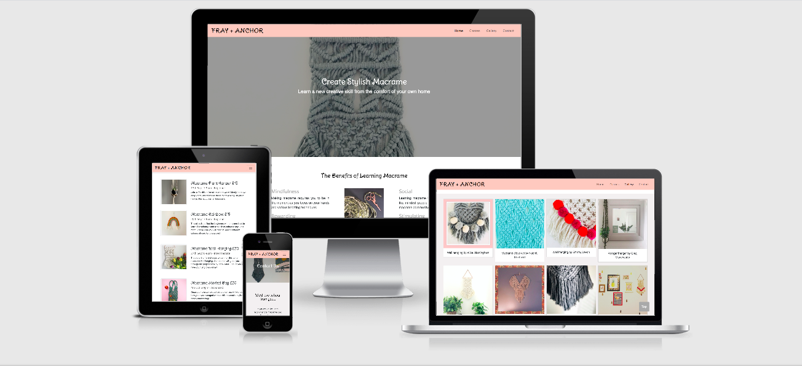

# Fray + Anchor Macrame

## Code Institute - Milestone Project 1

Fray + Anchor is a fictional company which provides online macrame classes. The idea came to me whilst working on my own macrame projects - I have often thought it would be great to be able to ask a teacher about a specific technique or to be guided through a project whilst at home, rather than using YouTube videos or PDF patterns. I thought this service would be useful to others too in the same position, who want to take up macrame as a hobby but don’t have the time to teach themselves and aren’t able to make a class in person. 

This project is the first of four Milestone Projects that make up the Full Stack Web Development Program at The Code Institute, and the main requirements were to make a responsive and static website with a minimum of 3 pages using HTML5 and CSS3. 
 
Click ![here] (https://chloelewisdev.github.io/milestone-project-1/index.html) to view the website live. 

## **User Experience**
This section provides insight into the UX process, focusing on who the Fray + Anchor website is for, the main aims of the project and how the website can help users meet their needs.  

### Project goals:
* To get people to enquire about upcoming macrame classes
* To learn about the benefits of macrame as a hobby
* To be able to easily contact Fray + Anchor with any questions
* To present information about the online macrame classes so that people understand easily what is available – times, price and what is included. 
* To create a website that is visually appealing, and fully responsive on all devices and screen sizes. 
* To make Fray + Anchor seem a reputable class provider, by creating a professional website

### User Stories

**New users:** 
* I am a user who is new to macrame - I need to be convinced why it would be a good craft to learn, and I also want to learn what is involved in a class – the price, the time and the result.  If I decide I am interested I want to be able to easily enquire on the website about an upcoming class. 
* I am a user who has learned some macrame previously but I am now ready to take on a more difficult project and want a teacher to guide me through this online as I am unable to attend any classes in person – I want to view the classes available and find one suited to my level. I want to make sure that a teacher would be available to help me with more advanced techniques. 
* I want to take an online macrame class, but I want to do a different project to the ones advertised on the website. I want to be able to contact the company to find out if they would consider teaching a different project and how much this would be. 

**Returning user:**
* I am a returning user who has already done one online macrame class, I loved it and want my work to feature on the image gallery. I therefore want to visit the site to learn what I need to do to feature on the image gallery on the website. I am also considering doing another class because I loved the first one so much, I want to view the classes available along with their suitability levels, and also learn if there is any discount for returning students. 

**Business Owner:**
* I am one of the owners of the business and want to see the company succeed. I want to clearly display information about upcoming classes in an attractive and informative way, and I want visitors to be able to easily able to enquire and contact the company easily. 

### Strategy plane: 
The main goal of the website is to attract users to enquire about an upcoming online macrame class. The website is aimed at a Business to Consumer creative audience. It should include minimal content and lots of imagery.  I started the UX process by creating the User Stories above which helped me work out who the project was aimed at and what I would need to include in the website to satisfy the needs of the users. 

### Scope plane:
The key features of the website were developed based on user needs. Users should be able to do the following on the website:

* Find out information about upcoming classes, including dates, times, content and price
* Enquire about an upcoming class
* Learn about the benefits of macrame 
* View the work of other students that have completed a class
* Learn how to submit completed class work to feature on the website’s gallery
* Contact the company with a question
* Visit social media channels
* Learn more about the company 

### Structure plane:

At this point I began to think about the information architecture and the different interactions that could take place across the site. I grouped the features into four main pages: ‘Home’, ‘Classes’, ‘Gallery’ and ‘Contact’ and thought about the navigation through the website and how the user could navigate across the pages. I knew I wanted to make it easy for users to go from the homepage to the classes page. Therefore I started to order the content with this in mind.  I wanted the pages to have some consistency, so thought about the homepage banner image, and how the following pages would also start with a header image, which would be shorter than the homepage banner image but following the same pattern. I decided that there should be some space under these starting images for some ‘content hinting’ underneath the starting images - I didn’t want the image to cover the full screen (across all devices). 

Once a form was completed, I knew I wanted to provide some kind of message to the user that this had been submitted. As I haven’t yet learned JavaScript I started to look into Bootstrap ‘modal’ messages after my mentor recommended this to me, and I looked into how this could work.  

I wanted to make sure the nav bar was always easy to view in order to help users navigate through the site, therefore I thought about a creating a fixed nav, and also I researched the ‘Burger icon’ which would enable viewers to easily move around the pages at all times when on a smaller device. 

### Skeleton plane:
I was at this stage ready to put together wireframes. I used Figma for these, creating wireframes for each page on desktop, tablet and mobile. 

I aimed to make sure the main content areas were expressed in similar ways, to create consistency. I also knew I wanted the CTA buttons to stand out and have a consistent design. 

I decided that the user would be presented with simple choices on each page – namely: homepage – view classes or view gallery, on the Classes page – submit enquiry form, on the gallery page – email, on the contact page – submit contact form. 
 
Because there will be quite a lot of imagery on the pages, I decided there needed to be plenty of space on each page to avoid the pages feeling cluttered, leaving the user overwhelmed. 

Whilst doing the wireframes, I considered whether to include the ‘image gallery’ on the homepage. I knew I wanted the user to firstly consider visiting the upcoming classes, and didn’t want to distract from this. However I thought about how the image gallery could actually persuade the user to view the upcoming classes too, so although this is secondary to the classes, it was important. I realised that I should enable the user to navigate to the Classes page from the image gallery page, in case they came here straight from the homepage. 

The wireframes can be viewed on [Figma](https://www.figma.com/file/ymDA1MVFFoQ4qH9hqnQnIj/Chloe-Lewis-Milestone-Project-1?node-id=0%3A1)

Please also find screenshots below:

### Surface plane: 

I next moved on the design work. 

**Colours:** Macrame is currently popular in fashion and interiors, therefore I knew I wanted the website to feel modern rather than having an ‘arts and crafts’ feel. I decided to use cool greys and light shades of pinks as the predominant colours with white and black accents in order to achieve this. 

**Fonts:** I used Google Fonts to select the fonts for my project. I wanted to find two fonts that worked well together – one for the logo and headings, and another for the body text. Overall I wanted the design to look modern, whilst also related to the craft of macrame. For the logo and headings, I decided to use Delius Swash Caps as I thought the cursive nature of this font could be related to macrame cord. I then used Open Sans for the body text which I thought complimented Delius Swash Caps.

**Images:** I had a lot of my own images from my own macrame projects so I decided to use these for the website, however I did use a stock image for the ‘Gallery’ pager header image. I took this from ![Unsplash}(https://www.unsplash.com) and the information for this image can be found below in the Credits section.

**Layout:** I decided to use different background colours to signal to the user different areas of content. I wanted the light pink colour to be prominent and so used this on the fixed nav and footer on all pages. I decided to use grey and white background colours to separate out the content on each page. I decided to keep this consistent with each page. I thought the white and light grey helped to keep a feeling of space on each page too, allowing the images and text to stand out. I decided to give the CTA buttons a darker grey shade with white text to help them stand out. 

## Features
The project consists of four different pages, all of which can be accessed through the menu in the nav bar. 

**Consistent features across all pages:**

-	The menu at the top of the page and the footer are consistent across all pages
-	There is a header image with overlaying title text on all pages.
-	The buttons used across the site are all the same colour and style.

**Home:** 

* Feature ‘Benefits of learning macrame’ – this feature is to promote the positive reasons to learn macrame to new users, and to reaffirm the benefits to returning users. 
* Feature ‘Upcoming Classes’ – three image cards with a description underneath displaying a selection of upcoming classes, with a button to click through to view ‘All classes’. This feature is to inform new and returning users about some of the projects available, creating interest in viewing more information about the classes. 
* Feature ‘Image Gallery’ – three images displaying work by past students. This feature is there to convince new users that the company is credible and trustworthy by showing real outcomes from real-life clients. The images are followed by a button 'View All' which takes users to the Gallery page where they can see even more real-life examples. 
* Feature ‘Scroll to top’ button – this feature enables the user to quickly move back to the top of the page, rather than having to scroll back up, improving the user experience especially on smaller screens. 

**Classes:**

* ‘Intro text’ feature – simple text for both new and returning users, introduces the user to the page whilst also providing some overview information applicable to all classes - materials needed, a bit about the teacher, class size. It includes information about a discount for returning students. Presenting this information straight away means users won’t be thinking about these questions whilst viewing the classes, and can concentrate on the class information. Within this section is an enquiry button which users can click on to move straight down to the enquiry form at the bottom of the page. I decided to add this feature at the top rather than adding an enquiry button to each class as I thought this would be too cluttered. This way, users viewing the different classes are never far away from being able to make an enquiry, either whilst closer to the top of the page or closer to the bottom of the page. 
* Classes feature – this is for new and returning users - there are 4 classes advertised with an image and text describing what the project is, price, when, how long it will take and suitability levels. 
* Feature ‘Enquire Today’ – this form enables new and returning students to easily enquire about an upcoming class. Users can select the class they would like to enquire about from a dropdown within the form. The labels for the form are positioned above the input fields, so that the label text doesn’t disappear when the user begins to submit some information, creating a better user experience.  
When the user completes the form, there is a modal that pops up with a ‘Thank you message’. 
* Feature ‘Scroll to top’ button - this feature enables the user to quickly move back to the top of the page, rather than having to scroll back up improving the user experience especially on smaller screens. 

**Gallery:**
* 'Intro text' feature – this short introductory text section explains that the images show work completed by by Fray + Anchor students. This text is for new and returning users - for new users it helps reaffirm the credibiily of the classes, and for returning students there is an e-mail link which can be clicked on if they wish to submit an image of their own work to be featured on the website’s gallery. 
* CTA for Classes?
* 'Image gallery' feature - There are 12 images, 4 on 3 rows, and each image is displayed on an image card, with a short description underneath explaining who did the work and where they are from. This feature is for new users as the image gallery provides visual evidence of the outcomes of the macrame classes, and it is also for returning users who may gain a sense of pride seeing their own work displayed on the website. 

**Contact:**
 
* 'Intro text' feature – this is a text section encouraging new and old students to get in touch with any questions, general enquiries and specific enquiries about possible projects by completing the form further down the page. 
* Feature 'Contact form' – The labels for the form are positioned above the input fields, so that the label doesn’t disappear when the user begins to submit some information.  When the user completes the form, there is a modal that pops up with a ‘Thank you message’. 

*Note - There is no ‘scroll to top’ button on this page as it is much shorter than the other pages.*

### Features to consider implementing in the future:

-	For the Gallery page, it could be good to have a simple form where students can upload an image of their work as an attachment within the form, rather than having to send as an attachment in an email. 
-	It would be great for credibility if testimonials could also be added to the website – possibly on the Gallery page 
-	A short video showing some basic knots could be useful to a new user, giving them a free taste of macrame to see if they enjoy it. Or a small form where the user submits their e-mail address and are then sent an e-mail containing a video with a basic knot tutorial for free - this would be a useful way to expand the customer database.  
-	An online booking or payment system for the classes 
-	The site could benefit from images of people enjoying making macrame – at the moment there are no faces and so the website lacks emotion.  This would be particularly relevant for the ‘Benefits of learning macrame’ section on the homepage.
-	It might be reassuring for the user to learn more about the teacher – possibly a feature with an image of the teacher and a short description about their background would be beneficial on the ‘Upcoming Classes’ page. 
-	It would be good if there was an option to sign up to a newsletter, which would help create a larger user database for future marketing. 

## Technologies Used

**Languages, libraries, frameworks, editors and version control**
* HTML5
    * The language used to create the form and add content to the website.
* CSS3
    * The language used to style the HTML5 elements 
* JavaScript
    * I used this language several times to improve the user experience, for example
* [Bootstrap framework](https://getbootstrap.com/) 
    * In order to have a ‘mobile first approach’ for my website, I used Bootstrap's grid container system 
* Gitpod
    * I used Gitpod's development environment to write the code for the website
* Git Version Control
    * I used Git for Version Control to record changes and updates to my files
* GitHub
    * I used GitHub’s repository hosting service to host my deployed website as well as track previous versions of my code 

**Other tools used:**

* [Figma](https://www.figma.com/)
    *I used Figma to create wireframes for my project for desktop, mobile and iPad. My mentor Seun Owonikoko Figma to me. 
* XXX
    * This was the source for one of the images in my project, please see the Media section below for more details on this. 
* [Google Fonts](https://fonts.google.com/)
    *I used the following fonts for my website: 
* [Favicon](https://favicon.io/)
    * I used this website to create the favicon for the website and followed the steps on this website to learn how to add it to my code. 

*Note: I also found [Stack Overflow](https://stackoverflow.com/) and [W3C Schools](https://www.w3schools.com/) helpful resources throughout the project, as well as the Code Institute Slack Community. 

## Testing:

### Testing User Stories:
NEED TO DO

### Validating the code:

[W3C Markup Validation Service](https://validator.w3.org/) 
**HTML** I validated the HTML with the W3 Validation Service.

[W3 CSS Validation Service](http://www.css-validator.org/)
**CSS** I validated the CSS with the W3 CSS Validation Service.

### Testing on different browsers:
I manually tested the website on the following browsers:
* Chrome
* Safari
* Mozilla Firefox

### Testing responsiveness:

I manually tested the website by using Google Developer Tools to check each individual page and the website as a whole worked on different devices and different screen sizes. 

### Issues found…
* I added an image carousel for the Gallery page initially, but I struggled to get this to be responsive on all screens and it created a bad user experience, because if the user didn't swipe across to view the next image, many would be easily missed. Whereas in my opinion users are much more used to scrolling down (on a mobile) through images, like on a social media feed for example, therefore I decided to create an image gallery with rows instead so that on smaller screens the user could just scroll down, and on medium to larger screens I could display a lot of the images on the screen before the user scrolled, requiring very little action from the user with instant impact. 

* One issue I had with the forms, was that when I added the modal thank you message, the user could still submit the form even if the required fields hadn’t been completed. I decided to remove the ‘required’ button to avoid frustration for the user, but then thought this would be a real problem for the business owner, and so added the 'required' fields back in. Therefore this is something that would need to be changed with some JavaScript.

## Deployment
This project was developed in GitPod and deployed to the hosting platform GitHub Pages.

I took the following steps to deploy the Fray + Anchor through to GitHub Pages:
-	Loaded GitHub in Chrome web browser and signed in.
-	Clicked on ‘My Repositories’
-	Navigated to 
-	Selected ‘settings’
-	Scrolled to the GitHub Pages area of the page
-	Selected ‘Master Branch’ from the ‘Source’ dropdown menu
-	Confirmed my selection
-	Fray+Anchor is now live on GitHub Pages. 

## Credits

**Content**
The content for this website is fictional and written by myself. The images are almost all my own, except for one which was taken from Unsplash and is referenced below. 

**Media**
The images for this website were taken by myself, except for the following image:

* The header image on the Gallery page, which was taken by user Elena Putina on Unsplash and can be viewed on the following link: [Unsplash](https://unsplash.com/photos/2JOxWQoxGtU)

**Acknowledgements:**
Thanks to my mentor Seun Owonikoko for her suggestions and time. 
Thanks also to my family for taking the time to look over the website and their feedback. 
Thanks to the Code Institute Slack Community. 

## Gitpod Reminders

To run a frontend (HTML, CSS, Javascript only) application in Gitpod, in the terminal, type:

`python3 -m http.server`

